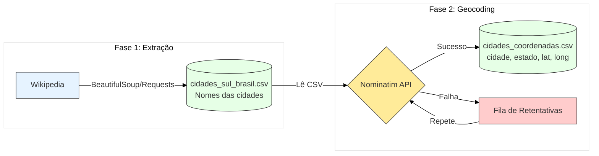
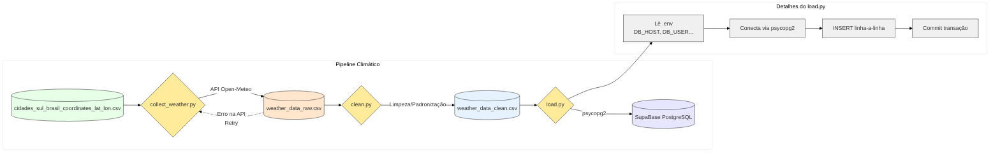

# Case técnico: Extração de dados climáticos das cidades do Sul do Brasil

## Descrição do projeto

Este projeto tem como objetivo coletar, processar e analisar dados climáticos das cidades da região Sul do Brasil (Paraná, Santa Catarina e Rio Grande do Sul). O processo está dividio em três etapas principais:

### 1. Coleta de dados geográficos de cidade do sul do Brasil: Extração via Web Scraping da lista de municípios dos três estados da região Sul a partir da Wikipédia e dados de latitude e longitude via API Nominatim.

📁 cidades_sul/script

Nesta pasta, está disponível em `get_cities.py` o código utilizado para extrair das tabelas contidas em páginas da Wikipédia o nome de todas as cidades pertencentes aos estados do Paraná, Santa Catarina e Rio Grande do Sul utilizando BeautifulSoup.

Nessa mesma pasta, também está disponível o código `get_lat_lon.py`, onde foi utilizada a API Nominatim para consultar a latitude e longitude de todas as cidades 1192 cidades extraídas no código anterior. 

📁 cidades_sul/data

Nessa pasta, constam dois arquivos .csv: 

- `cidades_sul_brasil.csv`: contém as cidades obtidas pelo site Wikipedia e o estado a qual elas pertencem.

- `cidades_sul_brasil_coordinates_lat_lon.csv`: contém as cidades obtidas pelo site Wikipedia, o estado a que elas pertencem e sua respectiva latitude e longitude.

### 2. Coleta de dados climáticos: Consulta à API open-meteo para obter informações metereológicas com base nas coordenadas obtidas.

📁clima/scripts

Em `clima/scripts` está disponível o processo ETL utilizado para obter os dados climáticos de todas as cidades percentecentes a região Sul do país. 

`collect_weather.py` utiliza o arquivo `cidades_sul_brasil_coordinates_lat_lon.csv` para fazer a requisição na API open-meteo. O arquivo csv resultante (`weather_data_raw.csv`) é passado por `clean.py`, onde é realizada a limpeza e então o arquivo limpo é passado para `load.py`, onde é carregado para o banco de dados PostGres SupaBase.

### 3. Consumindo o banco de dados 

📁 plot_clima_tempo/scripts

O banco de dados é consultado a partir do SUPABASE_URL e SUPABASE_KEY e, para testes, foram criados os códigos `prob_chuva.py`, `temperatura_maxima.py` e `temperatura_minima.py`. Esses gráficos utilizam um arquivo .shapefile da região sul, disponibilizado pelo IBGE, para delimitar o território e realizar uma interpolação, resultando em gráficos climáticos como:

