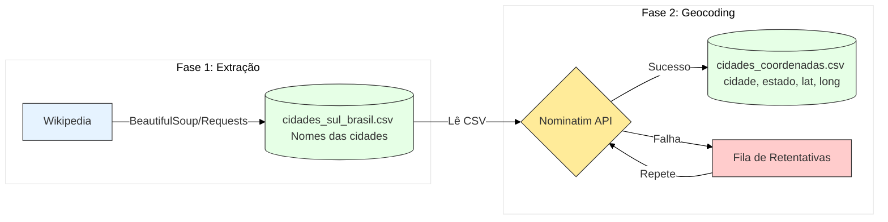
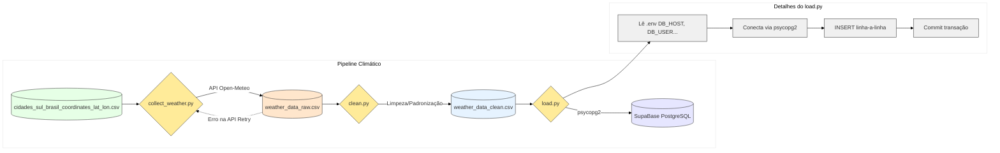

# 🌤️ Case técnico: Extração de dados climáticos das cidades do Sul do Brasil

## Descrição do projeto

Este projeto tem como objetivo coletar, processar e carregar (para um banco de dados PostGres) dados climáticos das cidades da região Sul do Brasil, abrangendo os estados do Paraná, Santa Catarina e Rio Grande do Sul. O fluxo está dividido em três etapas principais:

### 1. Coleta de dados geográficos

Objetivo: Extrair a lista de municípios dos três estados da região Sul a partir da Wikipédia e obter suas respectivas coordenadas geográficas (latitude e longitude) via API Nominatim.

📁 cidades_sul/script:

- `get_cities.py`: Código responsável por realizar Web Scraping nas páginas da Wikipédia para extrair os nomes de todas as cidades do Paraná, Santa Catarina e Rio Grande do Sul, utilizando a biblioteca BeautifulSoup.

- `get_lat_lon.py`: Utiliza a API Nominatim para obter as coordenadas (latitude e longitude) das 1.192 cidades extraídas.

📁 cidades_sul/data

Nessa pasta, constam dois arquivos .csv: 

- `cidades_sul_brasil.csv`: Lista de cidades e seus respectivos estados, extraídos da Wikipédia.

- `cidades_sul_brasil_coordinates_lat_lon.csv`: Contém os mesmos dados do arquivo anterior, com a adição das coordenadas geográficas de cada cidade.

Esta etapa do projeto segue o fluxograma:




### 2. Coleta de dados climáticos

Objetivo: Obter dados metereológicos dos três próximos dias (sábado, domingo e segunda-feira) para cada cidade com base em suas coordenadas, utilizando a API Open-Meteo.

📁clima/scripts

- `collect_weather.py:` Realiza requisições à API Open-Meteo com base nas coordenadas presentes no arquivo `cidades_sul_brasil_coordinates_lat_lon.csv`, gerando o arquivo `weather_data_raw.csv`.

- `clean.py:` Responsável pela limpeza dos dados brutos.

- `load.py:` Carrega os dados tratados para um banco de dados PostgreSQL hospedado no Supabase.



### 3. Consumindo o banco de dados - visualização

Objetivo: Consumir os dados do banco de dados Supabase para gerar visualizações dos dados.

📁 plot_clima_tempo/scripts

A partir das credenciais `SUPABASE_URL` e `SUPABASE_KEY`, o banco de dados é acessado para gerar diferentes gráficos, utilizando um arquivo shapefile da região Sul do Brasil (disponibilizado pelo IBGE) para delimitação geográfica e interpolação espacial.

Scripts disponíveis para visualização:

- `prob_chuva.py`: mapa de probabilidade de chuva;
- `temperatura_maxima.py`: mapa de temperatura máxima;
- `temperatura_minima.py`: mapa de temperatura mínima.

# Como rodar o projeto

1. Clonar  repositório

     `git clone https://github.com/luizcaixeta/case_tecnico_10_pasteis`
     `cd case_tecnico_10_pasteis`

2. Instale as dependências

   `pip install -r requirements.txt`

3. Execute a pipeline de coleta de dados

a) Extração de cidades e coordenadas 

```
    cd cidades_sul/script
    python get_cities.py
    python get_lat_lon.py
```

Os arquivos `.csv` gerados estarão em `cidades_sul/data`.

b) Coleta e tratamento de dados climáticos

```
    cd ../../clima/scripts
    python collect_weather.py
    python clean.py
    python load.py
```
Nota: Certifique-se de configurar corretamente suas credenciais do Supabase em um arquivo `.env`, este arquivo deve conter:

```
    DB_HOST=seu_host
    DB_PORT=porta_do_projeto
    DB_NAME=postgres
    DB_USER=postgres
    DB_PASS=sua_senha
```
Certifique-se também de que tenha criado uma tabela no banco de dados da forma

```
CREATE TABLE clima_cidades_sul (
  id SERIAL PRIMARY KEY,
  cidade TEXT NOT NULL,
  estado TEXT NOT NULL,
  latitude DOUBLE PRECISION,
  longitude DOUBLE PRECISION,
  timestamp TIMESTAMP NOT NULL,
  temperatura_max REAL,
  temperatura_min REAL,
  prob_chuva_max INTEGER,
  prob_chuva_media INTEGER,
  prob_chuva_min INTEGER,
  quantidade_chuva REAL,
  sensacao_termica_max REAL,
  sensacao_termica_min REAL,
  velocidade_vento_max DOUBLE PRECISION,
  direcao_vento DOUBLE PRECISION,
  duracao_sol REAL,
  uv_max INTEGER,
  dia_semana TEXT,
  chance_alta_de_chuva BOOLEAN
);
```

c) Gerar visualizações

```
    cd ../../plot_clima_tempo/scripts
    python ptob_chuva.py
    python temperatura_maxima.py
    python temperatura_minima.py
```

Nota: Certifique-se de configurar corretamente suas credenciais do Supabase em um arquivo `.env`, este arquivo deve conter:

```
    SUPABASE_URL= 
    SUPABASE_KEY=
```

Caso queira visualizar o resultado, está disponível em:

📁 arquivo_banco_dados


Agradeço a oportunidade!


    

